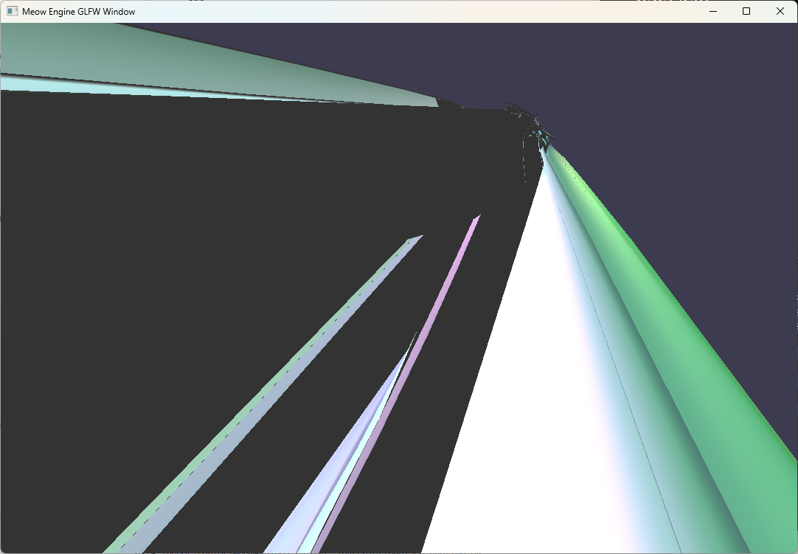
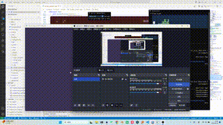
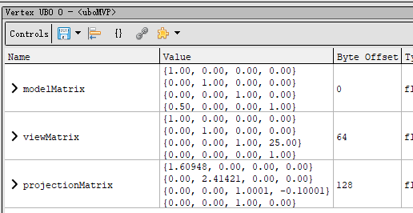

## Transfrom Debug

不知道为什么，获取变换矩阵的函数始终有问题

```cpp
glm::mat4 GetTransform() const
{
    glm::mat4 transform;

    glm::mat3 rotation_mat = glm::mat3_cast(rotation);

    // Set up final matrix with scale, rotation and translation
    transform[0][0] = scale.x * rotation_mat[0][0];
    transform[0][1] = scale.y * rotation_mat[0][1];
    transform[0][2] = scale.z * rotation_mat[0][2];
    transform[0][3] = position.x;
    transform[1][0] = scale.x * rotation_mat[1][0];
    transform[1][1] = scale.y * rotation_mat[1][1];
    transform[1][2] = scale.z * rotation_mat[1][2];
    transform[1][3] = position.y;
    transform[2][0] = scale.x * rotation_mat[2][0];
    transform[2][1] = scale.y * rotation_mat[2][1];
    transform[2][2] = scale.z * rotation_mat[2][2];
    transform[2][3] = position.z;

    // No projection term
    transform[3][0] = 0;
    transform[3][1] = 0;
    transform[3][2] = 0;
    transform[3][3] = 1;

    return transform;
}
```

如果 position 为 0，那么就不会出现错误

如果 position 不为 0，那么就会出现这样的



试了一下单个物体的



发现会有这样哈哈镜的效果

于是再看 UBO



确实是出错了，位置的信息出现在缩放这里了

于是输出一下我的原始数据

```cpp
            ubo_data.model = transfrom_comp_ptr2->GetTransform();

            std::cout << ubo_data.model[0][0] << ',' << ubo_data.model[0][1] << ',' << ubo_data.model[0][2] << ','
                      << ubo_data.model[0][3] << std::endl;
            std::cout << ubo_data.model[1][0] << ',' << ubo_data.model[1][1] << ',' << ubo_data.model[1][2] << ','
                      << ubo_data.model[1][3] << std::endl;
            std::cout << ubo_data.model[2][0] << ',' << ubo_data.model[2][1] << ',' << ubo_data.model[2][2] << ','
                      << ubo_data.model[2][3] << std::endl;
            std::cout << ubo_data.model[3][0] << ',' << ubo_data.model[3][1] << ',' << ubo_data.model[3][2] << ','
                      << ubo_data.model[3][3] << std::endl;
            std::cout << std::endl;

            // ubo_data.model = glm::rotate(ubo_data.model, glm::radians(180.0f), glm::vec3(0.0f, 1.0f, 0.0f));

            for (int32_t i = 0; i < model_comp_ptr->model_ptr.lock()->meshes.size(); ++i)
            {
                m_obj2attachment_mat.BeginObject();
                m_obj2attachment_mat.SetLocalUniformBuffer("uboMVP", &ubo_data, sizeof(ubo_data));
                m_obj2attachment_mat.EndObject();
            }
        }
```

输出的确实是对的

```
1,0,0,0.5
0,1,0,0
0,0,1,0
0,0,0,1
```

后面发现是 glm 的矩阵是列主序

## Uniform Buffer offset debug

发现我每个物体绑定的 UBO 都是同一个……

于是输出一下我的 offset

```cpp
    void Material::BindDescriptorSets(vk::raii::CommandBuffer const& command_buffer, int32_t obj_index)
    {
        FUNCTION_TIMER();

        if (obj_index >= per_obj_dynamic_offsets.size())
        {
            return;
        }

        std::cout << "per_obj_dynamic_offsets[obj_index]" << std::endl;
        for (int i = 0; i < per_obj_dynamic_offsets[obj_index].size(); i++)
        {
            std::cout << "per_obj_dynamic_offsets[obj_index][i] = " << per_obj_dynamic_offsets[obj_index][i]
                      << std::endl;
        }

        std::cout << std::endl;

        command_buffer.bindDescriptorSets(vk::PipelineBindPoint::eGraphics,
                                          *shader_ptr->pipeline_layout,
                                          0,
                                          descriptor_sets,
                                          per_obj_dynamic_offsets[obj_index]);
    }
```

对应的 draw 是

```cpp
    void DeferredPass::Draw(vk::raii::CommandBuffer const& command_buffer)
    {
        FUNCTION_TIMER();

        m_obj2attachment_mat.BindPipeline(command_buffer);

        // Debug
        if (m_query_enabled)
            command_buffer.beginQuery(*query_pool, 0, {});

        std::shared_ptr<Level> level_ptr = g_runtime_global_context.level_system->GetCurrentActiveLevel().lock();
        const auto&            all_gameobjects_map = level_ptr->GetAllGameObjects();
        for (const auto& kv : all_gameobjects_map)
        {
            std::shared_ptr<GameObject>     model_go_ptr = kv.second;
            std::shared_ptr<ModelComponent> model_comp_ptr =
                model_go_ptr->TryGetComponent<ModelComponent>("ModelComponent").lock();

            if (!model_comp_ptr)
                continue;

            for (int32_t i = 0; i < model_comp_ptr->model_ptr.lock()->meshes.size(); ++i)
            {
                m_obj2attachment_mat.BindDescriptorSets(command_buffer, i);
                model_comp_ptr->model_ptr.lock()->meshes[i]->BindDrawCmd(command_buffer);

                ++m_render_stat[0].draw_call;
            }
        }
```

于是发现了问题在哪……输入的是 mesh 的序号还要加上 gameobject 的序号

于是改了

```cpp
    void DeferredPass::Draw(vk::raii::CommandBuffer const& command_buffer)
    {
        FUNCTION_TIMER();

        m_obj2attachment_mat.BindPipeline(command_buffer);

        // Debug
        if (m_query_enabled)
            command_buffer.beginQuery(*query_pool, 0, {});

        std::shared_ptr<Level> level_ptr = g_runtime_global_context.level_system->GetCurrentActiveLevel().lock();
        const auto&            all_gameobjects_map = level_ptr->GetAllGameObjects();
        for (const auto& kv : all_gameobjects_map)
        {
            std::shared_ptr<GameObject>     model_go_ptr = kv.second;
            std::shared_ptr<ModelComponent> model_comp_ptr =
                model_go_ptr->TryGetComponent<ModelComponent>("ModelComponent").lock();

            if (!model_comp_ptr)
                continue;

            for (int32_t i = 0; i < model_comp_ptr->model_ptr.lock()->meshes.size(); ++i)
            {
                m_obj2attachment_mat.BindDescriptorSets(command_buffer, m_render_stat[0].draw_call);
                model_comp_ptr->model_ptr.lock()->meshes[i]->BindDrawCmd(command_buffer);

                ++m_render_stat[0].draw_call;
            }
        }
```

但是输出还是不对

```cpp
    void Material::BindDescriptorSets(vk::raii::CommandBuffer const& command_buffer, int32_t obj_index)
    {
        FUNCTION_TIMER();

        if (obj_index >= per_obj_dynamic_offsets.size())
        {
            return;
        }

        std::cout << "obj_index = " << obj_index << std::endl;
        std::cout << "per_obj_dynamic_offsets[obj_index]" << std::endl;
        for (int i = 0; i < per_obj_dynamic_offsets[obj_index].size(); i++)
        {
            std::cout << "per_obj_dynamic_offsets[obj_index][i] = " << per_obj_dynamic_offsets[obj_index][i]
                      << std::endl;
        }

        std::cout << std::endl;

        command_buffer.bindDescriptorSets(vk::PipelineBindPoint::eGraphics,
                                          *shader_ptr->pipeline_layout,
                                          0,
                                          descriptor_sets,
                                          per_obj_dynamic_offsets[obj_index]);
    }
```

```
obj_index = 3
per_obj_dynamic_offsets[obj_index]
per_obj_dynamic_offsets[obj_index][i] = 0

obj_index = 4
per_obj_dynamic_offsets[obj_index]
per_obj_dynamic_offsets[obj_index][i] = 0

obj_index = 5
per_obj_dynamic_offsets[obj_index]
per_obj_dynamic_offsets[obj_index][i] = 0

obj_index = 6
per_obj_dynamic_offsets[obj_index]
per_obj_dynamic_offsets[obj_index][i] = 0

obj_index = 7
per_obj_dynamic_offsets[obj_index]
per_obj_dynamic_offsets[obj_index][i] = 0

obj_index = 8
per_obj_dynamic_offsets[obj_index]
per_obj_dynamic_offsets[obj_index][i] = 0

obj_index = 9
```

offset 还是都是 0

于是 debug 内存分配

```cpp
    void Material::SetLocalUniformBuffer(const std::string& name, void* dataPtr, uint32_t size)
    {
        FUNCTION_TIMER();

        auto buffer_meta_iter = shader_ptr->buffer_meta_map.find(name);
        if (buffer_meta_iter == shader_ptr->buffer_meta_map.end())
        {
            RUNTIME_ERROR("Uniform {} not found.", name);
            return;
        }

        if (buffer_meta_iter->second.bufferSize != size)
        {
            RUNTIME_WARN("Uniform {} size not match, dst={} src={}", name, buffer_meta_iter->second.bufferSize, size);
        }

        // copy local uniform buffer to ring buffer

        uint8_t* ringCPUData = (uint8_t*)(ring_buffer.mapped_data_ptr);
        uint64_t bufferSize  = buffer_meta_iter->second.bufferSize;
        uint64_t ringOffset  = ring_buffer.AllocateMemory(bufferSize);

        memcpy(ringCPUData + ringOffset, dataPtr, bufferSize);

        std::cout << "obj_count = " << obj_count << std::endl;
        std::cout << "size = " << size << std::endl;
        std::cout << "buffer_meta_iter->second.dynamic_offset_index = " << buffer_meta_iter->second.dynamic_offset_index
                  << std::endl;
        std::cout << "ringOffset = " << ringOffset << std::endl;

        per_obj_dynamic_offsets[obj_count][buffer_meta_iter->second.dynamic_offset_index] = (uint32_t)ringOffset;
    }
```

部分输出

```
obj_count = 15
size = 192
buffer_meta_iter->second.dynamic_offset_index = 0
ringOffset = 0
obj_count = 16
size = 192
buffer_meta_iter->second.dynamic_offset_index = 0
ringOffset = 0
obj_count = 17
size = 192
buffer_meta_iter->second.dynamic_offset_index = 0
ringOffset = 0
obj_count = 18
size = 192
buffer_meta_iter->second.dynamic_offset_index = 0
ringOffset = 0
obj_count = 19
size = 192
buffer_meta_iter->second.dynamic_offset_index = 0
ringOffset = 0
obj_count = 20
size = 192
buffer_meta_iter->second.dynamic_offset_index = 0
ringOffset = 0
obj_count = 0
size = 2048
buffer_meta_iter->second.dynamic_offset_index = 0
```

确实发现每次分配都返回 0……为什么呢

于是发现是我的 debug stat 这里人为给分配的地址赋值成 0 了

```cpp
    uint64_t RingUniformBuffer::AllocateMemory(uint64_t size)
    {
        uint64_t new_memory_start = Align<uint64_t>(allocated_memory, min_alignment);

        if (new_memory_start + size <= buffer_size)
        {
            allocated_memory = new_memory_start + size;

            // stat
            begin = new_memory_start;
            usage = size;

            return new_memory_start;
        }
```

现在改好了，之前是 `new_memory_start = 0`